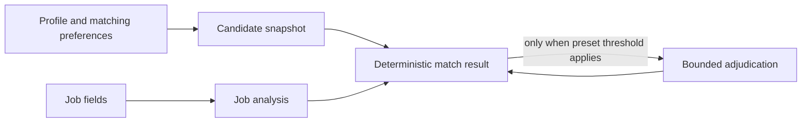

# AI Architecture

Switchy's AI subsystem is local-first. SQLite stores all durable state, provider API keys remain encrypted on the user's machine, and local workers execute restart-sensitive matching work. The design deliberately excludes hosted infrastructure, accounts, billing, a general agent loop, and embeddings.

## Capability runtime

Every provider call belongs to one named capability:

- `job_analysis` extracts structured evidence from untrusted job text.
- `match_adjudication` makes a bounded adjustment when deterministic evidence is inconclusive.
- `writing_cover_letter`, `writing_referral`, and `writing_recruiter_follow_up` produce grounded drafts.
- `resume_parse` normalizes deterministically extracted resume text.

The shared runtime resolves and decrypts the configured provider once for a logical execution, applies the capability policy, disables AI SDK retries, composes cancellation and timeout signals, validates structured output, and records the result in `aiRuns`. Application retries therefore remain the only retry owner, while still honoring the AI SDK provider error's retryability signal and retry delay. A configured model that is unavailable fails explicitly; model discovery happens only in provider settings, except for the one-time initialization of installations that have no concrete default model.

`aiRuns` records provider and model identifiers, capability and subject, prompt/schema/policy versions, input fingerprint, attempts, usage, timing, finish reason, cache status, quality result, and sanitized failures. It never stores raw prompts, resumes, API keys, or full job descriptions. Resume and job inputs are marked as untrusted data in prompts so instructions embedded in source text are not followed.

## Versioned evidence and freshness

Matching uses immutable artifacts rather than mutable score columns:



Canonical JSON is hashed with SHA-256. Candidate fingerprints include the summary, normalized skills, non-overlapping experience, education, and matching preferences. Job fingerprints include title, description, location and location type, seniority, department, employment type, and compensation text. Ordering and optional values are normalized before hashing.

A match is fresh only when its candidate fingerprint, job fingerprint, and scoring-policy version exactly match the current inputs. Status, saved, and application changes do not change these fingerprints. A profile-only change creates a candidate snapshot while reusing unchanged job analyses. Legacy job match columns are retained for data preservation but are neither read nor updated by current matching flows.

JSON text columns are accessed through repository methods that validate their contents with Zod. Corrupt or incompatible data fails at the repository boundary instead of propagating unchecked objects.

## Evidence-based scoring

Job analysis extracts must-have and preferred skills, minimum experience, seniority and management requirements, education, location constraints, employment type, compensation display data, domain keywords, confidence, and unresolved ambiguities. Changed jobs are analyzed in batches bounded by both job count and prompt characters. A failed extraction falls back to deterministic requirement and experience extraction with low confidence.

The base score weights are:

| Component | Weight |
| --- | ---: |
| Must-have skills | 35 |
| Preferred skills | 10 |
| Experience | 20 |
| Seniority | 10 |
| Location compatibility | 15 |
| Employment type | 10 |

Unavailable components are removed and the remaining weights are renormalized. An explicit experience gap of at least three years caps the score at 50, a seniority mismatch of at least two levels caps it at 55, and an explicit onsite-location conflict caps it at 50. Adjudication can adjust a score by at most 10 points and cannot exceed a deterministic cap.

Economy adjudicates below 0.40 confidence. Balanced adjudicates scores from 50 through 75 below 0.75 confidence. Quality adjudicates scores from 40 through 85 or whenever confidence is below 0.90. Confidence combines job-extraction confidence with the proportion of score-bearing evidence available.

The committed synthetic corpus covers score bands, hard constraints, missing information, and pairwise rankings without personal data. A scoring-policy cutover requires deterministic checks and at least 85 percent pairwise ranking accuracy.

## Durable matching queue

Manual, company, unmatched, and post-scrape matching all create a match session and `aiWorkItems` transactionally. API callers receive `202` and poll the common session endpoint; cancellation is a durable request rather than a process-local flag. When an entry point has zero jobs, it records an immediately completed, pollable session without creating an empty work item.

Workers claim leased items, heartbeat while running, renew ownership, checkpoint progress, schedule retries, and fence data operations. Expired leases are recoverable after restart. Startup conversion imports nonterminal legacy scrape-match outbox work idempotently while leaving completed legacy rows as history. The legacy unmatched-session response delegates to the current session implementation during compatibility migration.

An in-memory limiter is shared per provider process. Rate-limit responses reduce concurrency by one and honor provider retry delay when supplied. Twenty consecutive successes increase concurrency by one, never above the configured per-provider concurrency limit. This adaptive state does not mutate user settings.

## Writing

Writing uses one evidence packet containing the candidate snapshot, job analysis, match evidence, allowed links, and content-specific settings. Modification requests include the selected parent draft, and persisted variants retain their ancestry and associated AI run.

Streaming emits text deltas, followed by a complete event containing the atomically persisted content response and run ID. Aborted or invalid streams produce failed runs and no content variant. The compatibility synchronous endpoint calls the same service. Selected, copied, discarded, and manual-edit signals remain local; edit distance is computed server-side. Historical drafts are not sent with unrelated requests.

## Resume parsing

File handling and AI normalization are separate stages. PDF, DOCX, and text extractors produce plain untrusted text; the capability runtime then normalizes it using versioned prompts and schemas. Validation reports malformed dates, missing required values, duplicate skills, and suspicious URLs. The resume stores the parse run and parser version, while profile replacement remains an explicit user action.

## Observability and privacy

The AI history screen summarizes calls, success rate, tokens, latency, full match-result cache reuse, and sanitized failures over 7 or 30 days. Job-analysis reuse remains implicit in immutable artifact lookup rather than being counted as a provider call or full-result hit. Writing variants and match results link to safe run summaries. Switchy does not estimate currency because direct-provider pricing is not reliably available.

Sensitive source data stays in purpose-specific local tables and is sent only for the requested capability. Logs, API failures, match history, and run records use fingerprints, safe subjects, bounded metadata, and sanitized error codes/messages. Raw AI SDK provider errors are sanitized before crossing those boundaries because they may contain request values or response bodies. Never add raw provider payloads, prompts, keys, resumes, or full job descriptions to telemetry.

## Evaluation and version maintenance

Run deterministic AI evaluations with:

```bash
pnpm ai:eval
```

The suite covers matcher scoring and ranking, writing validators, and resume normalization. Live-provider evaluation is opt-in and remains outside `pnpm verify`.

When changing a prompt, schema, scoring rule, or execution behavior:

1. Increment the corresponding prompt, schema, scoring-policy, extractor, parser, or execution-policy version.
2. Add or update synthetic fixtures that demonstrate the intended behavior and failure cases.
3. Run `pnpm ai:eval` and the focused unit/integration tests.
4. Confirm existing fingerprints remain stable unless their canonical inputs intentionally changed.
5. Document any compatibility or artifact-freshness consequence.

Database migrations must be produced with `pnpm db:generate`; do not hand-write SQL. Migration tests set a temporary `HOME` and exercise both a fresh database and an upgrade fixture. Never point migration tests at the user's real `~/.switchy` state.
