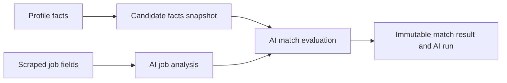

# AI Architecture

Switchy's AI subsystem is local-first. SQLite stores durable artifacts and telemetry, API keys remain encrypted on the user's machine, and restart-sensitive matching runs through the local leased-work queue. The system does not use a general agent loop, embeddings, hosted infrastructure, or Switchy-managed CLI credentials.

## Capability runtime

Every provider call belongs to a named capability:

- `job_analysis` extracts reusable structured evidence from untrusted job text.
- `match_evaluation` produces the complete candidate-to-job evaluation and final score.
- `writing_cover_letter`, `writing_referral`, and `writing_recruiter_follow_up` produce grounded drafts.
- `resume_parse` normalizes deterministically extracted resume text.

The shared runtime resolves one concrete provider/model snapshot per logical execution, owns retries and timeout policy, composes cancellation signals, validates output, and writes a sanitized `aiRuns` ledger entry. API-provider attempts use the configured hard deadline. Local CLI turns wait for provider completion and use the signal only for explicit cancellation, so a healthy long-running CLI turn is not interrupted merely because the API timeout elapsed. AI SDK retries are disabled. A configured unavailable model fails clearly and is never silently replaced.

Structured capabilities use portable JSON generation: Switchy gives the provider the JSON Schema through ordinary text generation, accepts only one JSON value (optionally in one JSON code fence), and validates it again with the original Zod schema. This path is shared by API providers, Codex CLI, and OpenCode CLI and avoids depending on inconsistent provider-native schema modes.

`aiRuns` records capability, safe subject, provider/model/backend, prompt/schema/policy versions, input fingerprint, attempts, token usage, latency, finish reason, quality result, and sanitized failure information. It never records raw prompts, job descriptions, resumes, account details, API keys, CLI transcripts, or raw provider errors.

## Provider-native controls

Reasoning controls are discovery-only and model-specific. Switchy has no fallback list of effort names and does not infer support from model IDs. Provider-advertised values, order, descriptions, and defaults are preserved. When a catalog does not enumerate exact choices, the UI displays that reasoning is provider-managed and execution omits an effort value.

Local CLI installation, authentication, version, and model discovery are probed automatically at startup and after executable-path changes. These bounded probes never generate content or consume model quota. Normal execution still fails explicitly when a selected provider/model cannot perform the requested capability; no cached test result can block or certify a model.

## Matching artifacts and execution

### Candidate snapshot

The candidate snapshot is local and deterministic because its purpose is provenance, not interpretation. It contains the user's supplied summary, skills, experience entries, education, preferred country/city, and calculated non-overlapping total experience. It does not infer seniority, management scope, domains, or match scores, and therefore has no model setting.

Canonical candidate inputs are SHA-256 fingerprinted. A relevant profile change creates a new immutable snapshot. When automatic matching is enabled, profile changes coalesce into a durable `profile_update` session for jobs with previous matches; unchanged job analyses are reused.

### Job analysis

Job analysis has its own provider, model, and provider-native reasoning setting. It returns only a short role summary and at most 20 material, source-grounded requirements. Each requirement retains an internal ID, type, importance, concise text, and source excerpt. Closely related requirements and technology alternatives are combined instead of repeated across separate skill, experience, education, constraint, ambiguity, or confidence fields.

Analyses are keyed by the job content fingerprint plus an extractor version that includes the analysis provider/model policy. Jobs are batched within both count and character limits. Only validated AI output is persisted. A failed or timed-out analysis creates no fallback artifact and the job's match fails clearly, so a later run can retry it.

### Final AI match

Final matching has a separate provider, model, and reasoning setting. The model receives the candidate facts snapshot as bounded evidence items and the saved job analysis—not the raw full job description. It returns only:

- one overall score and a short summary;
- category scores for responsibilities, skills and technologies, experience and seniority, and domain fit;
- four to six concise reasoning points;
- a compact matched-skills list.

There is no active deterministic scorer, keyword formula, fixed weight, deduction, bonus, hard cap, or LLM adjustment layered on top. The prompt tells the evaluator to recognize equivalent and transferable evidence, treat contextual technologies differently from genuine requirements, keep preferred qualifications modest, accept an overall experience difference of six months or less, reason holistically about larger differences, and treat missing data as unknown rather than a mismatch. Candidate and job evidence references remain internal for grounding and validation; the product presents only the concise reasoning. Every reasoning point must cite supplied evidence before persistence.

Presentation freshness depends only on the candidate fingerprint: a result becomes stale when the profile changes, not when the selected model, reasoning setting, job-analysis policy, or job content changes. Explicit rematching can still replace a result for the same candidate. Execution-cache reuse remains stricter and requires exact candidate fingerprint, job fingerprint, job-analysis version, and match-policy version equality. The startup migration pipeline removes pre-v3 match artifacts and clears deprecated job-level match payloads; active execution only writes `source: ai` results linked to a successful `match_evaluation` run.

The default API-provider per-attempt matching timeout is 120 seconds. User-configured values remain explicit settings and are never changed silently during execution. Local CLI providers keep separate bounded protocol timeouts for startup and JSON-RPC acknowledgements, but generation turns wait for completion or explicit cancellation rather than inheriting the API request deadline.

## Durable matching queue

Manual, company, unmatched, post-scrape, and profile-update matching all use durable match sessions and leased `aiWorkItems`. Work is pipelined per job: a cached analysis queues its final match immediately, and each newly persisted analysis does the same without waiting for the remaining analysis batches. When both phases share a provider, analysis uses a bounded share of the configured concurrency so ready matches can run alongside later analyses. A failed multi-job analysis response is split into smaller batches until the failing job is isolated.

`matchSessionJobs` stores each job's analysis and matching stage, artifact/run references, safe error, and phase timestamps. The match-session API returns independent analysis and matching counters plus these per-job rows. Settings and match history poll that durable snapshot once per second, so progress survives navigation and process recovery without an in-memory event dependency. Sessions also preserve cancellation, retry scheduling, leases, heartbeat, checkpoint recovery, and startup recovery. A provider/model resolution failure, invalid structured response, or timeout is recorded as a safe failure instead of being converted into a deterministic score.

An in-memory adaptive limiter is scoped per provider process. Rate-limit responses reduce concurrency and honor retry delay; sustained success restores concurrency up to the configured preset. Persisted user settings are never mutated automatically.

## Writing

Writing uses its independently configured provider/model through the same runtime. Its evidence packet contains candidate facts, the available job analysis, current match evidence, allowed links, content-specific settings, and—when modifying—a selected parent draft. Streaming emits deltas, then atomically persists a complete validated variant and its run. Aborted or invalid streams create no successful content. Variant ancestry, copied/selected/discarded signals, and server-computed edit distance remain local.

## Resume parsing

Resume file text extraction is deterministic and separate from AI normalization. The configured resume provider/model receives bounded untrusted extracted text and returns the versioned structured profile shape through portable JSON validation. Field-level validation reports malformed dates, missing required values, duplicate skills, and suspicious URLs. The resume stores its parse run and parser version. An existing profile is never destructively replaced without explicit user action.

## Local CLI providers

Codex CLI and OpenCode CLI are permanent keyless provider records. Switchy reuses the user's installed and authenticated CLI without reading or storing credentials.

Codex uses `codex app-server` v2 over stdio. Each execution uses an ephemeral thread in an empty temporary directory with read-only sandboxing, approvals disabled, no workspace roots, tools, skills, environments, or MCP servers. Switchy waits for the terminal turn notification even when generation exceeds the API-provider timeout. Explicit cancellation interrupts the turn and retires the process if acknowledgement is not received safely.

OpenCode starts the installed `opencode serve --pure` on a protected random loopback port. Switchy uses the SDK only as a client, creates isolated sessions with tools denied, listens to events, aborts through the session API, and deletes every created session. Portable structured generation intentionally avoids OpenCode's provider-dependent native `json_schema` behavior.

Both adapters reuse one supervised process while active and shut it down after five idle minutes. Model catalogs and connection status are cached, but normal execution never refreshes them. Provider APIs perform a cached-or-live non-generative probe if startup warming has not completed, so settings never needs a manual connectivity button.

## Evaluation and maintenance

Run synthetic evaluations with `pnpm ai:eval`. Normal verification uses fake providers and CLIs and never accesses real credentials or quota. Maintainers may run isolated live verification against synthetic data outside the product UI; unconfigured providers must be reported as blocked rather than certified.

When changing a prompt, schema, extractor, or match policy:

1. Increment the corresponding version.
2. Update synthetic fixtures for success, malformed output, retries, timeouts, and evidence grounding.
3. Run focused tests, `pnpm ai:eval`, and the full verification suite.
4. Confirm the intended artifact-freshness impact.
5. Keep telemetry sanitized and source text out of logs.

Database migrations must be generated with `pnpm db:generate`. Migration tests must use a temporary `HOME`, never the user's real Switchy database.
