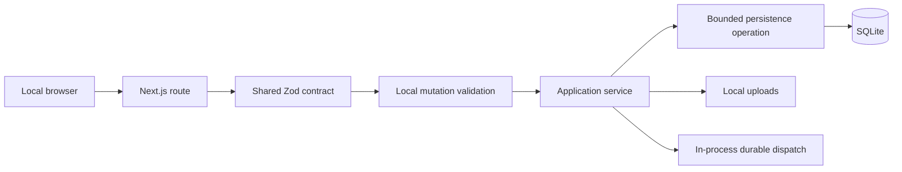

# Backend Architecture

Switchy is a local, single-device, single-user modular monolith. The Next.js
process owns the HTTP API, application services, scheduler, durable work
dispatchers, SQLite connection, and local filesystem storage. There is no
authentication service, tenancy boundary, remote database, object store,
distributed queue, or cloud worker.

## Request flow



Routes are transport adapters. A JSON route parses its path, query, and body
with schemas under `lib/api/contracts`, validates local mutation integrity,
invokes one use-case-specific application service, and serializes a contracted
response. Transaction choice, not-found behavior, state transitions, and
follow-on scheduling belong to the service. Persistence functions remain
bounded to their use cases; there is no universal CRUD repository.

The browser JSON boundary uses `apiRequest(input, init, responseSchema,
fallbackMessage)`. Successful JSON is runtime-validated before it reaches UI
state. Streaming and downloads validate their parameters and error envelopes
but do not pass their successful bodies through JSON validation.

## Local request and error contract

Switchy binds development and production servers to `127.0.0.1`. Mutations
must be same-origin, carry `x-switchy-request`, and pass strict Origin/Referer
parsing. This is browser request-integrity validation for a local service, not a
multi-user authentication system.

Every request receives an `ApiRequestContext` request ID. Errors use:

```ts
interface ApiErrorEnvelope {
  error: string;
  code: string;
  details?: unknown;
  requestId: string;
}
```

The request ID is also returned in `x-request-id` and included in structured
server error logs. Validation errors are `400`, missing resources are `404`,
conflicts are `409`, and unexpected failures are sanitized `500` responses.

## Persistence ownership

SQLite is the only database. Drizzle owns schema definitions and generated,
append-only migrations. `pnpm dev` and `pnpm start` run the persistence
preflight and migration chain automatically before the application starts.
Schema changes must be made in `lib/db/schema.ts` and generated with
`pnpm db:generate`; generated migration SQL is inspected but never hand-edited.

Core invariants are enforced in both contracts and SQLite: singleton profile,
company URL identity, resume version/current uniqueness, canonical job status,
score ranges, nonnegative counters, and required ownership keys. Multi-record
settings, company synchronization, people import, and scheduler recovery use
immediate transactions so a local interruption cannot expose a partial state.

Resume files remain under the local uploads directory. Their database lifecycle
uses `staging`, `ready`, `deleting`, and `missing` states so startup reconciliation
can finish or safely report interrupted filesystem/database operations.

## Runtime ownership and health

The scheduler and durable scrape/match queues stay inside the Next.js process.
SQLite leases prevent overlapping manual, scheduled, and recovery work.
Scheduler recovery is one versioned serialized setting, and startup recovery is
idempotent. Scrape dispatch, current matcher dispatch, and legacy matcher import
have independent readiness states so an unrelated success cannot hide stranded
work.

- `/api/health/live` is process liveness.
- `/api/health/ready` requires database access, scheduler initialization, and
  all required queue recovery states.
- `/api/health/runtime` exposes sanitized timestamps, oldest queued-work age,
  expired lease count, and the last subsystem error code.

Local provider checks are optional and never make the web application unready.
Database or migration failure does.

## Backup and restore

`pnpm state:backup` uses SQLite's online backup API and snapshots the consistent
database, uploads tree, and matching encryption secret when present. It detects
database changes made while uploads are copied and aborts without publishing the
snapshot; retry after the local upload or deletion finishes. The
manifest records format/application versions, environment, relative artifact
paths, sizes, and SHA-256 checksums. Snapshot directories use mode `0700` and
files use `0600`.

Verification checks paths, checksums, required artifacts, schema readability,
foreign keys, and SQLite integrity. Restore requires a stopped application and
`--replace`; it validates before touching current state, creates a rollback
snapshot, validates a sibling staging state, and switches directories by rename.

## Recovery runbook

1. Stop `pnpm dev` or `pnpm start` before restore or manual state inspection.
2. Run `pnpm state:backup:verify -- --from <snapshot-directory>`.
3. If current state is readable, create one more snapshot before intervention.
4. Restore with `pnpm state:restore -- --environment production|development --from <snapshot-directory> --replace`.
5. Start Switchy and check `/api/health/ready`, then `/api/health/runtime`.
6. Confirm the profile, current resume, uploads, company/job counts, and recent
   scrape/match histories before deleting the automatic rollback snapshot.
7. If readiness still reports a database failure, stop the app and retain both
   snapshots; do not edit the database or generated migrations by hand.

## Verification

`pnpm verify` runs lint, typecheck, Knip dead-code analysis, all root tests,
dependency audit, and the production build. `pnpm verify:all` additionally
verifies the landing workspace. Integration coverage includes temporary SQLite
databases, the full fresh migration chain, migration from version 24, backup and
restore, storage reconciliation, application services, routes, and runtime
health.
