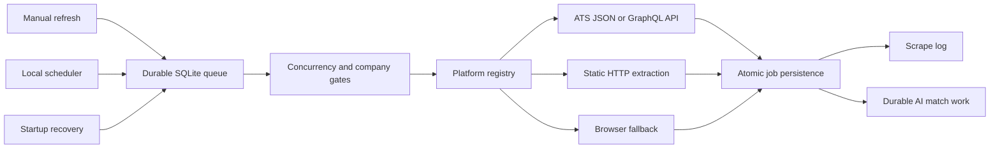

# Scraper Architecture

Switchy runs its scraping pipeline entirely on the user's device. SQLite is the durable coordinator; there is no cloud queue, remote worker service, Redis dependency, or external control plane.

## Runtime flow

Manual and scheduled requests use the same in-process supervisor. Each company is represented by a durable queue item with an attempt count, retry time, cancellation flag, worker lease, and serialized result. A process restart recovers expired leases and continues unfinished work.

Identical company batches are coalesced while they are in flight even when manual and scheduler triggers overlap. The first request owns the durable session metadata; concurrent callers receive that same session result instead of scraping the same companies twice.

## Module boundaries

`createLocalScrapeQueueService()` and `getLocalScrapeQueueService()` are the public composition boundary. The queue service is a thin façade for enqueueing, waiting, recovery, and cancellation; batch work never bypasses the durable queue.

- `application/` owns the one-company pipeline, work handler, session projection, and retention policy.
- `runtime/` owns transport-independent leased work, heartbeats, bounded retry, single-flight dispatch, shared/exclusive resource coordination, and keyed company locks. Scraping and matching use the same runtime.
- `queue/`, `history.ts`, and `maintenance.ts` adapt scraper persistence ports to the existing SQLite schema. `lib/ai/work-items/` owns durable matching work.
- `platforms/` owns extraction only. Shared listing selection preserves platform object identity while applying early filters and existing-ID exclusion; detail hydration is bounded and cancellation-aware.
- `settings/` is the typed source for scraper concurrency, filters, and retention defaults.

The durable match handoff is created in the same transaction as committed scrape results. Post-scrape, manual, company, and unmatched matching all create `aiWorkItems` and use the same durable match-session lifecycle. The local worker reports claim, progress, retry, completion, cancellation, and recovery transitions through the shared leased-work runtime.

## Extraction strategy

The preferred order is:

1. Use a documented or stable ATS JSON/GraphQL endpoint when one is available.
2. Use direct HTTP extraction for server-rendered listing pages.
3. Use the browser transport only when JavaScript execution, cookies, or anti-CSRF behavior requires it.
4. Keep platform-specific selectors and request logic behind the scraper registry.

This hybrid approach remains the right fit for a local application. Replacing every scraper with a headless browser would increase memory usage and failure surface. Replacing platform adapters with a generic AI extraction step would make results slower, less deterministic, and harder to test. AI-assisted extraction can be added later as an explicit fallback, but should not become the primary path for ATS platforms with structured endpoints.

External payload validation is strict for the response envelope and job identity fields, but tolerant of optional, nullable, and polymorphic metadata. When some jobs are malformed, adapters retain usable jobs, mark listing completeness as partial, and prevent missing-job archival.

Each scraper declares whether it can run in parallel or must run exclusively. Workday-like browser-heavy adapters remain serial; API adapters share the user-configured concurrency budget. Separate sessions cannot scrape the same company simultaneously.

## Reliability guarantees

- Session creation and queue insertion are one SQLite transaction.
- Queue claims use leases and atomic compare-and-update transitions.
- Retryable scraper errors use bounded exponential backoff and honor a platform retry delay.
- Job synchronization, company metadata, audit logging, and the matching handoff commit atomically.
- If the process stops after job persistence but before queue completion, the queue result is rebuilt from the committed scrape log instead of scraping again.
- Startup recovery handles expired work and schedules future retry or lease times.
- Browser-session bootstrap failures identify the sanitized launch, navigation, settle, or session-extraction stage without persisting cookies, tokens, headers, or response bodies.
- Timer drift only marks scheduler recovery as pending. Recovery waits until the app has remained visible, focused, and online for ten seconds, preventing DarkWake from starting network work.
- Eightfold and Workday retry missing list offsets with one refreshed browser session before committing a partial result. Workday also retries failed details once and retains listing-only jobs when hydration remains unavailable.
- ServiceNow follows all advertised listing pages up to a 100-page safety cap, retries failed navigation, and applies early filtering before detail hydration.
- Cancellation stops the parent session, cancels queued items immediately, and signals running items.
- Job or company deletion terminates related scrape and match work before data is removed.
- SQLite busy errors on queue transitions receive short bounded retries.

The queue provides at-least-once execution with idempotent completion. Platform fetches can be repeated after a crash, but committed job results are not repeated once their success or partial log exists.

## Local resource controls

The Settings page exposes:

- **Max Parallel Scrapes**: the shared API/browser concurrency limit, from 1 to 10.
- **Keep Mac awake while scraping**: enabled by default. During an active queue dispatch on macOS, Switchy holds a bounded idle-sleep assertion. The display and screensaver may still activate, closing the lid may still sleep the Mac, and the setting is a no-op on other operating systems.
- **History Retention**: terminal scrape sessions and logs are pruned after 7 to 3,650 days; the default is 90 days.

Retention never deletes jobs, companies, uploads, active/leased queue work, or an active matching handoff. Pruning runs on the first supervisor pass after startup and is then throttled to at most once per day for that process.

The macOS assertion uses `/usr/bin/caffeinate -i -t 300` and renews every four minutes only while the queue is actively dispatching work. It is released after success, failure, or cancellation and while the supervisor is only waiting for a future retry. Launch and release failures are warnings and never change the scrape outcome.

## Observability and recovery

The scrape-session detail page merges queue state and company logs into one live company-progress view. Each row shows status, attempts, retry and lease timing, scrape counts, matching progress, and all attempt warnings or errors. The underlying API is `GET /api/scrape-history/:id`.

For local troubleshooting:

1. Open **History → Scrape** and inspect the company-progress view.
2. A `queued` item with attempts remaining will run at its `availableAt` time.
3. A `running` item with an expired lease is recovered on startup or the next supervisor pass.
4. Destructive maintenance signals related in-process work first, then takes an exclusive data-operation fence before deleting records.
5. Run `pnpm db:studio` when direct local database inspection is needed.
6. Run `pnpm verify` before releasing scraper changes.

## Migration compatibility

Generated migrations are append-only once they may have been applied to a local database. Migrations 0012 through 0014 intentionally remain as a correction chain: the final schema is correct for fresh installs, while retaining the intermediate hashes keeps existing local databases compatible. Do not squash or rewrite those files; generate any future schema change with Drizzle.

## Adding a platform

1. Prefer the platform's structured endpoint and implement its adapter under `lib/scraper/platforms/`.
2. Return the typed scraper result contract, including listing completeness, structured errors, and partial-result issues.
3. Declare transport and concurrency capabilities accurately.
4. Register the adapter in the scraper registry.
5. Add fixture-based parser tests, error classification tests, and pipeline characterization coverage under `tests/`.
6. Verify cancellation is passed through every network or browser operation.

Do not put persistence or durable queue retries inside a platform adapter. Transport-specific recovery of missing pages or details may happen inside the adapter before the result is committed; once a partial result is committed, replay protection remains authoritative.

## Test layout

- `tests/unit/` contains isolated Node tests for policies, adapters, runtimes, and API mapping.
- `tests/integration/` contains real temporary-SQLite and migration coverage.
- `tests/ui/` contains jsdom component and hook tests.
- `tests/helpers/` contains shared test-only database and client stubs; `tests/fixtures/` contains platform payload builders.

Production code must never import `@test/*`. Use `pnpm test:unit`, `pnpm test:integration`, and `pnpm test:ui` for focused work, then `pnpm verify` before committing scraper changes.
