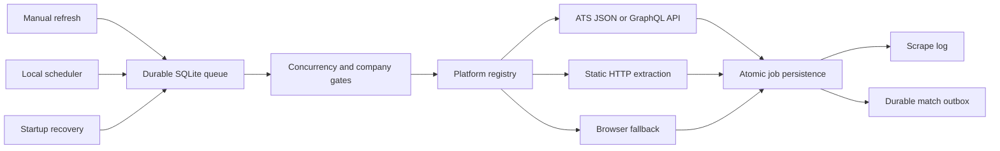

# Scraper Architecture

Switchy runs its scraping pipeline entirely on the user's device. SQLite is the durable coordinator; there is no cloud queue, remote worker service, Redis dependency, or external control plane.

## Runtime flow

Manual and scheduled requests use the same in-process supervisor. Each company is represented by a durable queue item with an attempt count, retry time, cancellation flag, worker lease, and serialized result. A process restart recovers expired leases and continues unfinished work.

Identical batch requests with the same trigger source are coalesced while they are in flight, preventing duplicate sessions from repeat submissions without merging independently scoped refreshes.

## Module boundaries

`createLocalScrapeQueueService()` and `getLocalScrapeQueueService()` are the public composition boundary. The queue service is a thin façade for enqueueing, waiting, recovery, and cancellation; batch work never bypasses the durable queue.

- `application/` owns the one-company pipeline, work handler, session projection, and retention policy.
- `runtime/` owns transport-independent leased work, heartbeats, bounded retry, single-flight dispatch, shared/exclusive resource coordination, and keyed company locks. Scraping and matching use the same runtime.
- `queue/`, `matching/`, `history.ts`, and `maintenance.ts` adapt the narrow persistence ports to the existing SQLite schema.
- `platforms/` owns extraction only. Shared listing selection preserves platform object identity while applying early filters and existing-ID exclusion; detail hydration is bounded and cancellation-aware.
- `settings/` is the typed source for scraper concurrency, filters, and retention defaults.

The durable match handoff is created in the same transaction as committed scrape results. Its handler reports all claim, progress, retry, completion, cancellation, and recovery transitions through `MatchWorkStore`; manual matching keeps its separate session lifecycle.

## Extraction strategy

The preferred order is:

1. Use a documented or stable ATS JSON/GraphQL endpoint when one is available.
2. Use direct HTTP extraction for server-rendered listing pages.
3. Use the browser transport only when JavaScript execution, cookies, or anti-CSRF behavior requires it.
4. Keep platform-specific selectors and request logic behind the scraper registry.

This hybrid approach remains the right fit for a local application. Replacing every scraper with a headless browser would increase memory usage and failure surface. Replacing platform adapters with a generic AI extraction step would make results slower, less deterministic, and harder to test. AI-assisted extraction can be added later as an explicit fallback, but should not become the primary path for ATS platforms with structured endpoints.

External payload validation is strict for the response envelope and job identity fields, but tolerant of optional, nullable, and polymorphic metadata. When some jobs are malformed, adapters retain usable jobs, mark listing completeness as partial, and prevent missing-job archival.

Each scraper declares whether it can run in parallel or must run exclusively. Workday-like browser-heavy adapters remain serial; API adapters share the user-configured concurrency budget. Separate sessions cannot scrape the same company simultaneously.

## Reliability guarantees

- Session creation and queue insertion are one SQLite transaction.
- Queue claims use leases and atomic compare-and-update transitions.
- Retryable scraper errors use bounded exponential backoff and honor a platform retry delay.
- Job synchronization, company metadata, audit logging, and the matching handoff commit atomically.
- If the process stops after job persistence but before queue completion, the queue result is rebuilt from the committed scrape log instead of scraping again.
- Startup recovery handles expired work and schedules future retry or lease times.
- Cancellation stops the parent session, cancels queued items immediately, and signals running items.
- Job or company deletion terminates related scrape and match work before data is removed.
- SQLite busy errors on queue transitions receive short bounded retries.

The queue provides at-least-once execution with idempotent completion. Platform fetches can be repeated after a crash, but committed job results are not repeated once their success or partial log exists.

## Local resource controls

The Settings page exposes:

- **Max Parallel Scrapes**: the shared API/browser concurrency limit, from 1 to 10.
- **History Retention**: terminal scrape sessions and logs are pruned after 7 to 3,650 days; the default is 90 days.

Retention never deletes jobs, companies, uploads, active/leased queue work, or an active matching handoff. Pruning runs on the first supervisor pass after startup and is then throttled to at most once per day for that process.

## Observability and recovery

The scrape-session detail page shows each queue item's status, attempt count, next retry time, lease, and last error. Company logs label superseded and final retry attempts, and partial results retain warning details. The underlying API is `GET /api/scrape-history?sessionId=<id>`.

For local troubleshooting:

1. Open **History → Scrape** and inspect the durable queue section.
2. A `queued` item with attempts remaining will run at its `availableAt` time.
3. A `running` item with an expired lease is recovered on startup or the next supervisor pass.
4. Destructive maintenance signals related in-process work first, then takes an exclusive data-operation fence before deleting records.
5. Run `pnpm db:studio` when direct local database inspection is needed.
6. Run `pnpm verify` before releasing scraper changes.

## Adding a platform

1. Prefer the platform's structured endpoint and implement its adapter under `lib/scraper/platforms/`.
2. Return the typed scraper result contract, including listing completeness, structured errors, and partial-result issues.
3. Declare transport and concurrency capabilities accurately.
4. Register the adapter in the scraper registry.
5. Add fixture-based parser tests, error classification tests, and pipeline characterization coverage under `tests/`.
6. Verify cancellation is passed through every network or browser operation.

Do not put persistence, retry loops, or session management inside a platform adapter. Those concerns belong to the shared pipeline.

## Test layout

- `tests/unit/` contains isolated Node tests for policies, adapters, runtimes, and API mapping.
- `tests/integration/` contains real temporary-SQLite and migration coverage.
- `tests/ui/` contains jsdom component and hook tests.
- `tests/helpers/` contains shared test-only database and client stubs; `tests/fixtures/` contains platform payload builders.

Production code must never import `@test/*`. Use `pnpm test:unit`, `pnpm test:integration`, and `pnpm test:ui` for focused work, then `pnpm verify` before committing scraper changes.
